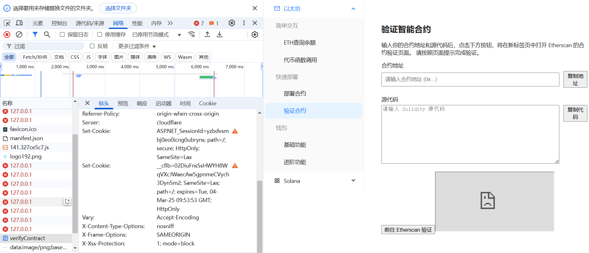

# 用以纪录每次更新的*功能变化* 以及 *计划*
## 更新计划表
-   计划引入1inch/uniswap的闪兑功能
-    

## 更新记录4
  
### 部署与验证问题
-  DeployContract 功能受阻
    WebAssembly.Compile is disallowed on the main thread, if the buffer size is larger than 8MB. Use WebAssembly.compile, compile on a worker thread, or use the flag `--enable-features=WebAssemblyUnlimitedSyncCompilation`. 
  通过 fetch 加载 soljson-v0.8.20+commit.a1b79de6.js，然后用 URL.createObjectURL 创建临时脚本。
这样避免了 Web Worker 的网络问题，但 solc/wrapper 内部仍然在主线程上执行 WebAssembly.compile。使用worker尝试仍旧失败。

    先调用remix部署工具，后续研究
- VerifyContract 功能受阻
  1.尝试  
  2.[etherscan 合约验证](https://etherscan.io/verifyContract) ethercan的合约验证功能无法通过iframe框架嵌入进工具，原因是Etherscan 的 https://etherscan.io/verifyContract 页面设置了 X-Frame-Options: SAMEORIGIN 。
  

  后续考虑引入hardhat工具实现验证和部署功能

## 更新记录3
-  引入bip39标准（助记词生成）

-------------------------------------------------------
## 更新记录2
-  钱包找回功能更新，初步版本
-  优化代码结构

-------------------------------------------------------
## 更新记录1
- 更新随机钱包生成
- 计划上线转账等功能的具体实现
- 计划上线区块链地址监听功能